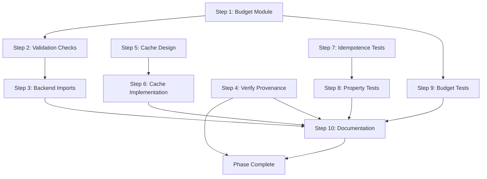

# Phase 3 Implementation Plan: Budgets, Caching, and Hardening

**Date**: 2026-01-17
**Phase**: Phase 3 - Budgets, Caching, and Hardening
**Status**: Planning Complete

---

## Overview

This plan addresses the four acceptance criteria for Phase 3:
1. Budgets enforced at validation stage (not only inside backends)
2. Reports include provenance for Starlark inputs (source hash + stdlib version)
3. Caching key strategy documented + implemented for `generate` (optional but preferred)
4. Canonicalization is idempotent; tests cover it

---

## Implementation Steps

### Step 1: Create Centralized Budget Module

**Complexity**: Medium
**Dependencies**: None
**Files**:
- NEW: `crates/speccade-spec/src/validation/budgets.rs`
- MODIFY: `crates/speccade-spec/src/validation/mod.rs`

**Description**:
Create a centralized module defining all budget constants and types. This eliminates duplication between validation and backend code.

**Changes**:
1. Create `budgets.rs` with:
   - `BudgetProfile` struct with named profiles (e.g., `default`, `zx-8bit`, `strict`)
   - `AudioBudget`, `TextureBudget`, `MeshBudget`, `MusicBudget`, `GeneralBudget` structs
   - Default budget constants migrated from backends
   - `BudgetProfile::default()` returning the standard limits

2. Export budgets module from `validation/mod.rs`

**Budget Constants to Centralize**:
| Source | Constant | Value |
|--------|----------|-------|
| `recipe_outputs_audio.rs:110-111` | `MAX_AUDIO_DURATION_SECONDS` | 30.0 |
| `recipe_outputs_audio.rs:110-111` | `MAX_AUDIO_LAYERS` | 32 |
| `common.rs:52-53` | `MAX_DIMENSION` | 4096 |
| `common.rs:52-53` | `MAX_PIXELS` | 16,777,216 |
| `compose/expander_context.rs:16-19` | `MAX_RECURSION_DEPTH` | 64 |
| `compose/expander_context.rs:16-19` | `MAX_CELLS_PER_PATTERN` | 50,000 |
| `xm/header.rs:16-25` | `XM_MAX_CHANNELS` | 32 |
| `xm/header.rs:16-25` | `XM_MAX_PATTERNS` | 256 |
| `it/header.rs:16-25` | `IT_MAX_CHANNELS` | 64 |

---

### Step 2: Add Validation-Stage Budget Checks

**Complexity**: Medium
**Dependencies**: Step 1
**Files**:
- MODIFY: `crates/speccade-spec/src/validation/recipe_outputs_audio.rs`
- MODIFY: `crates/speccade-spec/src/validation/recipe_outputs_music.rs`
- MODIFY: `crates/speccade-spec/src/validation/recipe_outputs_texture.rs`
- MODIFY: `crates/speccade-spec/src/validation/mod.rs`

**Description**:
Update validation functions to use centralized budgets. Add missing budget checks that currently only exist in backends.

**Changes**:

1. **Audio validation** (`recipe_outputs_audio.rs`):
   - Replace inline constants with `budgets::AudioBudget::default()`
   - Already validates: duration, layers, sample_rate

2. **Music validation** (`recipe_outputs_music.rs`):
   - Add channel count validation against `budgets::MusicBudget::max_channels(format)`
   - Add pattern count validation for compose recipes
   - Add instrument count validation

3. **Texture validation** (`recipe_outputs_texture.rs`):
   - Resolution validation already uses `common::validate_resolution()`
   - Add node count limit validation (graph node count)
   - Add validation for maximum graph depth

4. **General validation** (`mod.rs`):
   - Add optional `BudgetProfile` parameter to `validate_for_generate()`
   - Default to `BudgetProfile::default()` when not specified

---

### Step 3: Update Backends to Import from Spec Crate

**Complexity**: Low
**Dependencies**: Step 1
**Files**:
- MODIFY: `crates/speccade-backend-audio/src/generate/mod.rs`
- MODIFY: `crates/speccade-backend-music/src/compose/expander_context.rs`
- MODIFY: `crates/speccade-backend-music/Cargo.toml` (add speccade-spec dependency if needed)

**Description**:
Have backends import budget constants from the centralized module instead of defining their own.

**Changes**:
1. Remove duplicate `const MAX_*` definitions
2. Import from `speccade_spec::validation::budgets`
3. Keep backend-specific runtime limits (e.g., buffer allocation caps) as internal constants with comments explaining why they differ from validation limits

**Note**: Some backend constants are internal implementation details (e.g., `MAX_DELAY_MS` for specific effects) and should remain in backends. Only user-facing budget limits should be centralized.

---

### Step 4: Verify Provenance Fields in Reports (Already Complete)

**Complexity**: Low (Verification only)
**Dependencies**: None
**Files**:
- VERIFY: `crates/speccade-spec/src/report/mod.rs`
- VERIFY: `crates/speccade-spec/src/report/builder.rs`
- VERIFY: `crates/speccade-cli/src/commands/generate.rs`

**Description**:
Research confirmed that provenance fields are already implemented:

| Field | Location | Status |
|-------|----------|--------|
| `source_kind` | `Report` struct | Implemented |
| `source_hash` | `Report` struct | Implemented |
| `stdlib_version` | `Report` struct | Implemented |
| `recipe_hash` | `Report` struct | Implemented |

The `generate.rs` command correctly populates these via `with_provenance()` helper.

**Changes**:
1. Add test verifying provenance fields are populated for Starlark sources
2. Add test verifying provenance fields are populated for JSON sources
3. Document provenance schema in `docs/` (optional)

---

### Step 5: Design and Document Caching Strategy

**Complexity**: Medium
**Dependencies**: None (design only)
**Files**:
- NEW: `docs/caching.md` (documentation)
- MODIFY: `crates/speccade-cli/src/commands/generate.rs` (implementation)

**Description**:
Design the caching key structure and invalidation strategy.

**Cache Key Components**:
```
cache_key = BLAKE3(recipe_hash || backend_version || stdlib_version || budget_profile_id)
```

**Cache Directory Structure**:
```
.speccade/
  cache/
    {cache_key_prefix}/
      {full_cache_key}/
        artifacts/
          {output_files}
        report.json
        metadata.json  # timestamp, source_path for debugging
```

**Invalidation Rules**:
1. **Always invalidate**: `git_dirty=true`
2. **Content-based**: recipe_hash change
3. **Toolchain-based**: backend_version change, stdlib_version change
4. **Budget-based**: budget_profile change

**CLI Integration**:
- `--no-cache`: Bypass cache entirely
- `--cache-dir <path>`: Custom cache location (default: `.speccade/cache`)
- Cache hits log at debug level

---

### Step 6: Implement File-Based Caching (Optional)

**Complexity**: High
**Dependencies**: Step 5
**Files**:
- NEW: `crates/speccade-cli/src/cache/mod.rs`
- NEW: `crates/speccade-cli/src/cache/key.rs`
- NEW: `crates/speccade-cli/src/cache/storage.rs`
- MODIFY: `crates/speccade-cli/src/commands/generate.rs`
- MODIFY: `crates/speccade-cli/src/main.rs` (add --no-cache flag)
- MODIFY: `crates/speccade-cli/src/lib.rs`

**Description**:
Implement file-based caching for generation outputs.

**Changes**:

1. **Cache key module** (`cache/key.rs`):
   - `CacheKey` struct with fields: `recipe_hash`, `backend_version`, `stdlib_version`, `budget_profile`
   - `CacheKey::compute()` -> BLAKE3 hash string
   - `CacheKey::from_report()` constructor for validation

2. **Cache storage module** (`cache/storage.rs`):
   - `CacheStorage` struct with configurable root path
   - `lookup(key) -> Option<CachedResult>`
   - `store(key, artifacts, report) -> Result<()>`
   - `invalidate(key) -> Result<()>`
   - Atomic writes (write to temp, rename)

3. **Integration** (`commands/generate.rs`):
   - Before dispatch: check cache
   - On cache hit: copy artifacts, return cached report
   - On cache miss: run generation, store to cache
   - Respect `--no-cache` flag

4. **CLI flag** (`main.rs`):
   - Add `--no-cache` flag to Generate command
   - Add `--cache-dir` option

---

### Step 7: Add Canonicalization Idempotence Tests

**Complexity**: Low
**Dependencies**: None
**Files**:
- MODIFY: `crates/speccade-spec/src/hash.rs` (add tests)
- NEW: `crates/speccade-tests/tests/canonicalization.rs`

**Description**:
Add explicit tests verifying canonicalization is idempotent.

**Test Cases**:

1. **Basic idempotence**:
   ```rust
   fn test_canonicalization_idempotent() {
       let value = json!({"b": 1, "a": 2});
       let canon1 = canonicalize_json(&value).unwrap();
       let reparsed: Value = serde_json::from_str(&canon1).unwrap();
       let canon2 = canonicalize_json(&reparsed).unwrap();
       assert_eq!(canon1, canon2);
   }
   ```

2. **Nested objects**:
   - Deep nesting (5+ levels)
   - Mixed arrays and objects

3. **Float edge cases**:
   - Integer-like floats: `1.0`, `42.0`, `1e15`
   - Small decimals: `0.1`, `0.000001`
   - Scientific notation: `1.23e10`
   - Edge values: `0.0`, `-0.0`
   - Large values: `1e308`

4. **String edge cases**:
   - Empty strings
   - Unicode characters
   - Escape sequences: `\n`, `\t`, `\"`
   - Control characters

5. **Empty structures**:
   - Empty object `{}`
   - Empty array `[]`
   - Nested empties `{"a": {}, "b": []}`

6. **Round-trip validation**:
   ```rust
   fn test_canonicalize_roundtrip() {
       let original = make_complex_value();
       let canon = canonicalize_json(&original).unwrap();
       let reparsed: Value = serde_json::from_str(&canon).unwrap();
       assert_eq!(original, reparsed);  // Semantic equality
   }
   ```

---

### Step 8: Add Property-Based Tests (Optional)

**Complexity**: Medium
**Dependencies**: Step 7
**Files**:
- MODIFY: `crates/speccade-spec/Cargo.toml` (add proptest dev-dependency)
- NEW: `crates/speccade-spec/src/hash/proptest.rs`

**Description**:
Add property-based tests using `proptest` for comprehensive edge case coverage.

**Properties to Test**:

1. **Canonicalization idempotence**: `canonicalize(canonicalize(x)) == canonicalize(x)`
2. **Determinism**: Same input always produces same output
3. **Key ordering**: Object serialization is independent of insertion order
4. **Array preservation**: Array order is preserved

**Example**:
```rust
proptest! {
    #[test]
    fn canonicalization_idempotent(json in arb_json_value()) {
        let canon1 = canonicalize_json(&json)?;
        let reparsed: Value = serde_json::from_str(&canon1)?;
        let canon2 = canonicalize_json(&reparsed)?;
        prop_assert_eq!(canon1, canon2);
    }
}
```

---

### Step 9: Add Budget Enforcement Tests

**Complexity**: Low
**Dependencies**: Step 2
**Files**:
- MODIFY: `crates/speccade-spec/src/validation/tests.rs`
- NEW: `crates/speccade-tests/tests/budget_enforcement.rs`

**Description**:
Add tests verifying budgets are enforced at validation stage.

**Test Cases**:

1. **Audio budgets**:
   - Reject `duration_seconds > MAX_AUDIO_DURATION_SECONDS`
   - Reject `layers.len() > MAX_AUDIO_LAYERS`
   - Reject invalid sample rates

2. **Music budgets**:
   - Reject XM with channels > 32
   - Reject IT with channels > 64
   - Reject pattern count exceeding format limit

3. **Texture budgets**:
   - Reject resolution > 4096x4096
   - Reject node count exceeding limit (if implemented)

4. **Consistent error codes**:
   - Verify budget violations produce `ErrorCode::BudgetExceeded` or appropriate code

---

### Step 10: Update Documentation

**Complexity**: Low
**Dependencies**: Steps 1-9
**Files**:
- NEW: `docs/budgets.md`
- MODIFY: `docs/README.md` (add link)
- MODIFY: `ARCHITECTURE_PROPOSAL.md` (update Stage C)

**Description**:
Document the budget system and caching strategy.

**Content**:
1. Budget profiles and their limits
2. How to specify custom budgets (future)
3. Cache key structure and invalidation
4. Provenance fields in reports

---

## Implementation Order



**Recommended Order**:
1. Step 7 (Idempotence tests) - Quick win, no dependencies
2. Step 4 (Verify provenance) - Verification only
3. Step 1 (Budget module) - Foundation for budget work
4. Step 2 (Validation checks) - Depends on Step 1
5. Step 5 (Cache design) - Can run in parallel with Steps 1-2
6. Step 9 (Budget tests) - Depends on Steps 1-2
7. Step 3 (Backend imports) - Cleanup, depends on Step 2
8. Step 8 (Property tests) - Optional, after Step 7
9. Step 6 (Cache implementation) - Optional, after Step 5
10. Step 10 (Documentation) - Final step

---

## Risk Mitigation

| Risk | Mitigation |
|------|------------|
| Breaking existing specs | Audit golden specs before enabling new budget checks |
| Cache invalidation bugs | Always invalidate on `git_dirty=true`; add `--no-cache` early |
| Float canonicalization edge cases | Add comprehensive tests before relying on caching |
| Backend budget divergence | Add CI check for duplicate constants |

---

## Acceptance Criteria Mapping

| Criterion | Steps |
|-----------|-------|
| Budgets enforced at validation | Steps 1, 2, 3, 9 |
| Provenance in reports | Step 4 |
| Caching strategy | Steps 5, 6 |
| Canonicalization idempotent | Steps 7, 8 |

---

## Estimated Effort

| Step | Complexity | Estimated Hours |
|------|------------|-----------------|
| 1 | Medium | 2-3h |
| 2 | Medium | 2-3h |
| 3 | Low | 1h |
| 4 | Low | 0.5h (verification) |
| 5 | Medium | 1-2h (design/doc) |
| 6 | High | 4-6h (optional) |
| 7 | Low | 1-2h |
| 8 | Medium | 2-3h (optional) |
| 9 | Low | 1h |
| 10 | Low | 1h |

**Total (required)**: ~8-12 hours
**Total (with optional)**: ~16-22 hours
